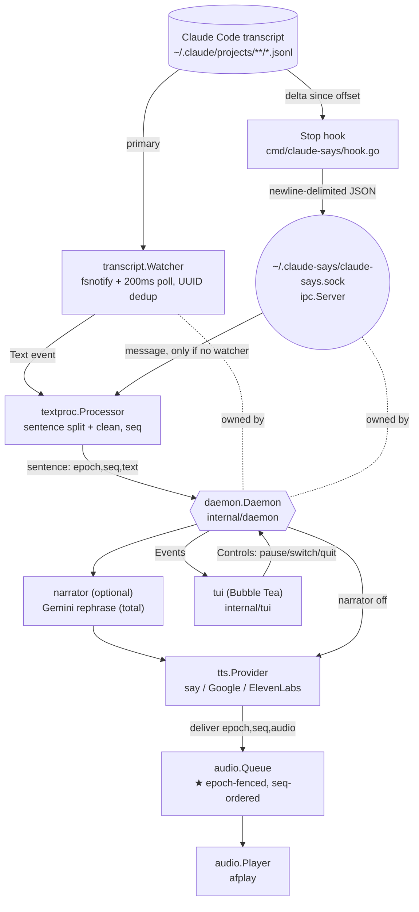

# Architecture — claude-says (Go)

A real-time text-to-speech companion for the Claude Code CLI. It watches Claude
Code's session transcript and speaks new assistant output aloud, optionally
rephrasing it through an LLM "narrator" first.

This describes the **Go implementation** — a single static binary
(`github.com/Sudhanshu069/claude-says`). The original Node.js version has been
removed; see the git history before the Go port if you need it for reference.

> Related: [CODE_REVIEW.md](CODE_REVIEW.md) and [SECURITY_AUDIT.md](SECURITY_AUDIT.md)
> document the *Node* version's defects — the ones this rewrite fixes by design
> are called out in §4.

---

## 1. Two runtime roles, one binary

`claude-says` is a single binary that plays two roles, meeting at a Unix domain
socket (`~/.claude-says/claude-says.sock`):

| Role | Entry point | Lifetime | Job |
|---|---|---|---|
| **Daemon** | `claude-says start` → [internal/daemon](../internal/daemon/daemon.go) | Long-running | Ingest text, synthesize speech, play it in order; drive the TUI |
| **Hook** | `claude-says hook` → [cmd/claude-says/hook.go](../cmd/claude-says/hook.go) | One short run per event | Push new transcript text to the daemon over the socket, then exit |

The `hook` subcommand is registered into `~/.claude/settings.json` as a Claude
Code **Stop** hook by `claude-says setup`. It is hidden from `--help` (it is an
internal entry point, not a user command) and self-limits to a hard **3-second**
deadline so it can never block Claude's output — stdin is read in a goroutine
raced against a `context` deadline so a never-EOF stdin still returns at 3s.

There are **two independent ways** text reaches the daemon, and only one is
active at a time:

1. **Transcript watcher (primary).** The daemon tails a session's JSONL
   transcript directly (fsnotify + a 200 ms safety poll) and needs no hook.
2. **Hook → IPC (fallback).** When the daemon is *not* watching a transcript, it
   accepts text pushed over the socket by the hook.

The daemon prefers the watcher: the IPC path is consumed only while no watcher is
active.

---

## 2. Data flow

```
Claude Code transcript (JSONL, append-only)
        │
        ├─(A) transcript.Watcher  fsnotify + 200ms poll ──┐
        │      internal/transcript/watcher.go             │
        │                                                 ▼
        └─(B) Stop hook reads delta ── IPC socket ── textproc.Processor
               cmd/claude-says/hook.go   internal/ipc   internal/textproc
                                                          │  split into sentences,
                                                          │  strip markdown / code / URLs,
                                                          │  assign monotonic seq
                                                          ▼
                                            (optional) narrator.Narrate ── Gemini
                                                          │       internal/narrator/gemini.go
                                                          ▼
                                            tts.Provider.Synthesize(ctx,text) → (audio, format)
                                                          │   say | Google Cloud | ElevenLabs
                                                          ▼
                                            audio.Queue   ★ epoch-fenced, seq-ordered
                                                          │   internal/audio/queue.go
                                                          ▼
                                            audio.Player → afplay (macOS)
                                                              internal/audio/player.go
```



---

## 3. Components

| Component | Package | Responsibility |
|---|---|---|
| `daemon.Daemon` | [internal/daemon](../internal/daemon/daemon.go) | Orchestrator: wires everything, picks the text source, routes sentence → synth → queue, handles session switching, graceful drain, and the TUI event/control channels |
| `ipc.Server` / `ipc.Client` | [internal/ipc](../internal/ipc/ipc.go) | Unix-socket server (daemon) and one-shot client (hook); newline-delimited JSON, size-capped, `lstat` non-follow guard |
| `transcript.Watcher` | [internal/transcript](../internal/transcript/watcher.go) | Tail a JSONL file (fsnotify + poll), read new bytes from a saved offset, emit each new assistant text block; dedupe by message UUID |
| `textproc.Processor` | [internal/textproc](../internal/textproc/processor.go) | Buffer text, split into sentences, strip markdown/URLs/paths, skip code & noise, assign monotonic `seq` |
| `narrator.Narrator` | [internal/narrator](../internal/narrator/narrator.go) → [gemini.go](../internal/narrator/gemini.go) | Optional LLM rephrase into 1–2 spoken sentences; **total** (`Narrate` never errors — returns the input on any failure). `Degrader.NarrateOrErr` exposes the underlying error for logging |
| `tts.Provider` + registry | [internal/tts](../internal/tts/tts.go) | `Synthesize(ctx, text) ([]byte, format, error)` and `Validate(ctx) error`; `New(cfg)` selects a provider |
| `audio.Queue` | [internal/audio/queue.go](../internal/audio/queue.go) | **Epoch-fenced, sequence-ordered** playback; reorders out-of-order synth results and drops stale-epoch ones (see §4) |
| `audio.Player` | [internal/audio/player.go](../internal/audio/player.go) | Write audio to a 0600 temp file, play via `afplay`, context-cancellable, clean up |
| `config` | [internal/config](../internal/config/config.go) | Load/Save `~/.claude-says/config.json` over `DefaultConfig()`; owner-only, atomic; resolves the socket path |
| `session` | [internal/session](../internal/session/session.go) | Discover sessions under `~/.claude/projects/`, resolve transcript paths, rank by mtime |
| `logx` | [internal/logx](../internal/logx/logx.go) | `log/slog` logger — colorized (tint) on a TTY, JSON when piped; level via env |
| `tui` | [internal/tui](../internal/tui/tui.go) | Bubble Tea model/update/view; consumes `daemon.Events()`, sends `daemon.Controls()` |
| CLI | [cmd/claude-says/main.go](../cmd/claude-says/main.go) | Cobra commands: `start` (default), `setup`, `sessions`, `providers`, `voices`, hidden `hook` |

### Provider abstraction

Every TTS backend implements the `tts.Provider` interface
(`Synthesize`/`Validate`) and is selected by `tts.New(cfg)`:

- [macos.go](../internal/tts/macos.go) — shells out to `say` via `os/exec` (no shell), with a `--` end-of-options guard so attacker-influenced text starting with `-` can never be parsed as a `say` flag (CWE-88). Default, zero config, lowest latency; emits AIFF.
- [google.go](../internal/tts/google.go) — Google Cloud TTS over REST with a per-request timeout; auth via `golang.org/x/oauth2/google` (application default credentials).
- [elevenlabs.go](../internal/tts/elevenlabs.go) — ElevenLabs REST with a per-request timeout.

`tts.List()` returns providers in the fixed display order `google, elevenlabs,
macos`. The narrator uses the same registry pattern, currently with one
implementation (Gemini).

---

## 4. Concurrency, ordering & the epoch fence (the core design)

The Node version's audio queue keyed entries by a bare `seq` that was **reused
across session resets** with no generation guard. That single omission caused the
worst bugs in the audit: a stale in-flight TTS result could overwrite the new
session's slot (cross-session **audio bleed**), and clear/resume races could spin
a drain loop on a stuck entry (**CPU hang**) or strand the last sentence. The Go
rewrite fixes all three **by construction** with an *epoch fence*.

### The mechanism

- Every queued item and every playback outcome carries **`{epoch, seq}`**.
- `seq` is assigned at exactly one place — `textproc.Processor` — monotonic within
  an epoch.
- A **single drain goroutine** owns playback. It plays strictly in `seq` order for
  the **current** epoch, one `afplay` at a time, gated by channels — there is no
  shared `draining` bool and no busy-loop.
- A **session switch bumps the epoch** *before* the queue is switched. Any synth
  that was already in flight for the old session resolves into a stale epoch and
  is **dropped on arrival** — it can never fill the new session's slot. This is
  what makes cross-session bleed impossible.
- A never-arriving or errored synth cannot deadlock the drain: the daemon
  guarantees exactly one delivery per `seq` (even on timeout/panic), and the
  queue's shutdown marker (`Quiesce`) is timeout-bounded.
- **Cancellation is `context`-based** throughout; on shutdown the drain goroutine
  closes its `done` channel so every sender becomes total (no goroutine leaks),
  after draining the final sentence within bound.

### Pause / resume

Pause cancels the in-flight `afplay` but keeps the current slot `ready` and does
**not** advance the play cursor; resume replays that sentence from the start. The
last sentence is therefore never stranded.

### Timing knobs

| Knob | Value | Where | Purpose |
|---|---|---|---|
| Transcript poll | **200 ms** | [transcript/watcher.go](../internal/transcript/watcher.go) | Safety net under fsnotify; the poll is the source of truth |
| Incomplete-buffer flush | **1500 ms** | [textproc/processor.go](../internal/textproc/processor.go) | Speak a trailing fragment that never got a terminator |
| Max chunk before force-flush | **500 chars** | [textproc/processor.go](../internal/textproc/processor.go) | Bound latency on long unpunctuated text |
| Hook hard deadline | **3 s** | [cmd/claude-says/hook.go](../cmd/claude-says/hook.go) | Hook can never hang the CLI (stdin read raced against ctx) |
| Narrator request timeout | context deadline | [narrator/gemini.go](../internal/narrator/gemini.go) | Bound LLM latency; falls back to raw text |
| Provider request timeout | context deadline | [tts/google.go](../internal/tts/google.go), [tts/elevenlabs.go](../internal/tts/elevenlabs.go) | A hung provider can't stall the pipeline |

A provider or narrator failure degrades a **single sentence** (it is logged via
`slog` and skipped); it never kills the daemon.

---

## 5. State, paths, and configuration

| Path | Written by | Contents |
|---|---|---|
| `~/.claude-says/claude-says.sock` | daemon | IPC listening socket (0600, inside the per-user dir, not `/tmp`) |
| `~/.claude-says/config.json` | config/setup | provider, voices, narrator settings (0600) |
| temp audio file (per chunk) | player | transient audio, 0600, deleted after playback |
| `os.TempDir()/claude-says-hook-debug.log` | hook (`--debug` only) | raw payload dump for debugging (0600) |
| `~/.claude/settings.json` | setup | the installed Stop hook entry |

`DefaultConfig()` ([config.go](../internal/config/config.go)) ships
`provider: "macos"`, so the tool works with **zero credentials** out of the box.
`Load()` overlays the saved JSON onto the defaults (Go's `encoding/json` only sets
present fields — the idiomatic deep-merge); a missing or malformed file returns
defaults. `Save()` writes to a temp file then `rename`s over the target (atomic)
and best-effort `chmod`s it to 0600, since it may hold API keys.

### Discovery

With no explicit `--session`/`-l`, the daemon auto-selects the most-recently
modified transcript under `~/.claude/projects/` (globally across projects — there
is intentionally no cwd scoping, matching the Node behavior). If none is found it
falls back to hook/IPC mode. An explicit `-s <id>` with no transcript also falls
back to hooks rather than erroring.

---

## 6. Extension points

**Add a TTS provider:** implement `tts.Provider`
(`Synthesize(ctx, text) ([]byte, string, error)`, `Validate(ctx) error`) in a new
file under [internal/tts](../internal/tts) and register it in
[tts.go](../internal/tts/tts.go) (add it to the registry and, if it should show in
the CLI, to the ordered provider list).

**Add a narrator:** implement `narrator.Narrator` (`Narrate(ctx, text) string` —
must be total) and register it in [narrator.go](../internal/narrator/narrator.go).
Implement the optional `Degrader` interface if you want failures logged.

---

## 7. Tech stack

- **Go 1.26**, single static binary, macOS-only (`say` for TTS, `afplay` for playback).
- [Bubble Tea](https://github.com/charmbracelet/bubbletea) + Lipgloss + Bubbles — TUI.
- [Cobra](https://github.com/spf13/cobra) — CLI.
- [fsnotify](https://github.com/fsnotify/fsnotify) — transcript watching.
- `log/slog` + [tint](https://github.com/lmittmann/tint) — logging.
- `golang.org/x/oauth2` — Google Cloud TTS auth.
- No runtime dependencies beyond the binary itself; standard library for IPC (`net`), HTTP (`net/http`), process control (`os/exec`), and file I/O.
